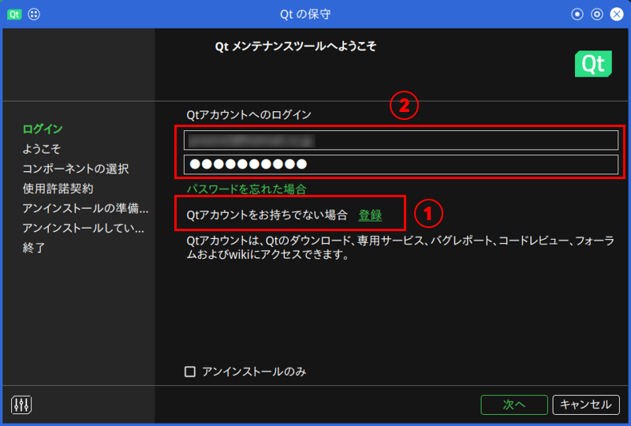
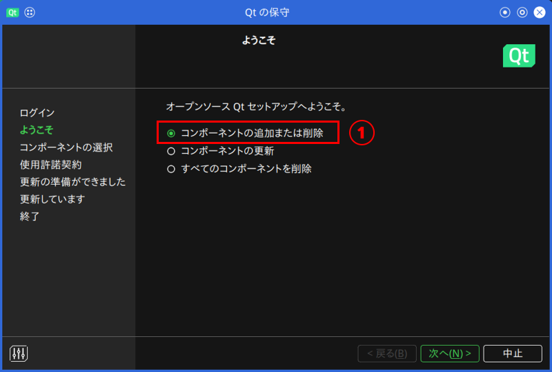
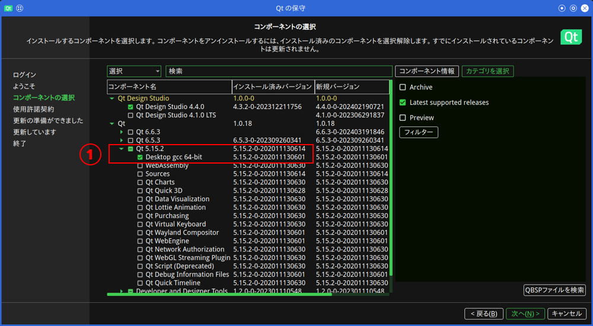

# qNewsFlash
 

URL : https://github.com/presire/qNewsFlash  
 

# はじめに  
qNewsFlashは、News APIや時事ドットコム等のニュース記事を取得して、0ch系の掲示板に書き込むソフトウェアです。  
現在、既存のスレッドにのみニュース記事を自動的に書き込むことができます。  

現在対応しているニュースサイトは、以下の通りです。  

* News API  
  ただし、無料版のNews APIはニュース記事が1日遅れのため、デフォルトでは無効です。  
  有料版で最も安いプランであるNews APIビジネスについては、月額$449となっております。  

* 時事ドットコム  

* 時事ドットコム (速報ニュース)  
  XPath式を使用して速報ニュース全体を取得しています。  
  <u>**速報ニュースは、他のニュース記事とは別に書き込みされます。**</u>  
   
  <u>※注意</u>  
  <u>XPath式を使用しているため、Webサイトの構成が変更された場合、併せてXpath式を変更する必要があります。</u>  

* 共同通信  

* 朝日新聞デジタル  
  ただし、RSSフィードに掲載されている記事には有料記事が多いため、デフォルトでは無効です。  

* CNET Japan  
  ニュース記事の概要を取得するためにXPath式を使用しています。  
   
  <u>※注意</u>  
  <u>XPath式を一部使用しているため、Webサイトの構成が変更された場合、併せてXpath式を変更する必要があります。</u>  

* ハンギョレ新聞  

* ロイター通信  
  ニュース記事の概要を取得するためにXPath式を使用しています。  
   
  <u>※注意</u>  
  <u>XPath式を一部使用しているため、Webサイトの構成が変更された場合、併せてXpath式を変更する必要があります。</u>  

* 東京新聞  
  XPath式を使用してニュース記事全体を取得しています。  
   
  <u>※注意</u>  
  <u>XPath式を使用しているため、Webサイトの構成が変更された場合、併せてXpath式を変更する必要があります。</u>  

 

**本ソフトウェアを動作させるには、Qt 5.15 / Qt 6 (Core、Network) および libxml 2.0が必要となります。**  
**Qt 6.5.3でも動作確認しています。**  
 

README.mdでは、Red Hat Enterprise LinuxおよびSUSE Linux Enterprise / openSUSEを前提に記載しております。  
また、他のLinuxディストリビューションにもインストールして使用できると思います。  
(例 : Linux Mint, Manjaro, MX Linux, ... 等)  

Raspberry Pi上での動作は確認済みです。  
 

**注意：**  
**version 0.1.0以降、0ch系の掲示板に書き込めるようになりました。**  

**新規スレッドを自動的に作成する機能は、version 0.3.0で追加されました。**  
**この機能は、ニュース記事を書き込んでいるスレッドのレス数が上限に達した時にスレッドを新規作成するものです。**  

<u>**レス数の上限は、設定ファイルの<code>max</code>値を指定してください。**</u>  

**version 0.4.0以降の設定ファイル (JSONファイル) は、version 0.3.x以前の設定ファイルと構造が異なります。**  
**そのため、以前のバージョンの設定ファイルをversion 0.4.0以降で使い回すことが出来ないことに注意してください。**  

**ご要望があれば、逐次開発を進めていく予定です。**  
 

今後の予定  
* !hogoコマンド機能の実装  
  1つのスレッドに対してニュース記事を書き込む場合、該当スレッドの2レス目以降に!hogoコマンドを書き込む。  
  これは、書き込みモード1、および、書き込みモード3の時事ドットコムの速報ニュースのスレッドに対して機能します。  
   
  <code>!hogo</code>コマンドが使用できる場合に有効です。</u>  
 
 

# 1. ビルドに必要なライブラリをインストール  
 

* Qt5 Core  
* Qt5 Network  
  * <https://www.qt.io/>  
  * qNewsFlashは、Qtライブラリを使用しています。
  * 本ソフトウェアで使用しているQtライブラリは、LGPL v3オープンソースライセンスの下で利用可能です。  
  * Qtのライセンスファイルは、以下に示すファイルで確認できます。  
    <I>**LibraryLicenses/Qt/LICENSE.LGPLv3**</I>  
 

* libxml 2.0  
  * <https://gitlab.gnome.org/GNOME/libxml2>  
  * qNewsFlashは、libxml 2.0を使用しています。  
  * libxml 2.0は、MITライセンスの下で利用可能です。  
  * libxml 2.0のライセンスファイルは、以下に示すファイルで確認できます。  
    <I>**LibraryLicenses/libxml2/LICENSE.MIT**</I>  
 

システムをアップデートした後、続いて本ソフトウェアのビルドに必要なライブラリをインストールします。  

    # Red Hat Enterprise Linux
    sudo dnf update   
    sudo dnf install coreutils coreutils-common make cmake gcc gcc-c++ \  
                     libxml2 libxml2-devel  
                     
                     # Qt 5 を使用する場合  
                     qt5-qtbase-devel  

                     # Qt 6 を使用する場合  
                     qt6-qtbase-devel \  
                     openssl3 openssl3-libs openssl3-devel  

    # SUSE Linux Enterprise / openSUSE
    sudo zypper update  
    sudo zypper install coreutils make cmake gcc gcc-c++ libxml2-devel \  
                        
                        # Qt 5 を使用する場合  
                        libqt5-qtbase-common-devel libQt5Core-devel    \  
                        libQt5Network-devel  
                        
                        # Qt 6 を使用する場合  
                        qt6-base-devel qt6-core-devel qt6-network-devel \  
                        openssl-3 libopenssl3 libopenssl-3-devel  

    # Debian GNU/Linux, Raspberry Pi OS  
    sudo apt update && sudo apt upgrade  
    sudo apt install coreutils make cmake gcc libxml2 libxml2-dev \  

                     # Qt 5 を使用する場合  
                     qtbase5-dev  

                     # Qt 6 を使用する場合  
                     qt6-base-dev  \
                     openssl libssl3 libssl-dev  # Qt 6を使用する場合  
 
 

# 2. ビルドおよびインストール
## 2.1. qNewsFlashのビルドおよびインストール
GitHubからqNewsFlashのソースコードをダウンロードします。  

    git clone https://github.com/presire/qNewsFlash.git qNewsFlash  

    cd qNewsFlash  

    mkdir build && cd build  
 

qNewsFlashをソースコードからビルドするには、<code>cmake</code>コマンドを使用します。  
Ninjaビルドを使用する場合は、<code>cmake</code>コマンドに<code>-G Ninja</code>オプションを付加します。  
 

ビルド時に使用できるオプションを以下に示します。  
 

* <code>CMAKE_BUILD_TYPE</code>  
  デフォルト値 : <code>Release</code>  
  リリースビルドまたはデバッグビルドを指定します。  
   
* <code>CMAKE_INSTALL_PREFIX</code>  
  デフォルト値 : <code>/usr/local</code>  
  qNewsFlashおよびqNewsFlash.shのインストールディレクトリを変更することができます。  
   
* <code>SYSCONF_DIR</code>  
  デフォルト値 : <code>/etc/qNewsFlash/qNewsFlash.json</code>  
  設定ファイル qNewsFlash.jsonのインストールディレクトリを変更することができます。  
   
* <code>SYSTEMD</code>  
  デフォルト値 : <code>OFF</code>  (無効 : Systemdサービスファイルはインストールされない)  
   
  指定できる値 1 : <code>system</code>を指定する場合 - <code>/etc/systemd/system</code>  
  指定できる値 2 : <code>user</code>を指定する場合 - <code>~/.config/systemd/user</code>  
   
  Systemdサービスファイル qNewsFlash.serviceのインストールディレクトリを変更することができます。  
   
* <code>PID</code>  
  デフォルト値 : <code>/var/run</code>  
  Systemdサービスを使用する場合、プロセスファイル qNewsFlash.pidのパスを変更することができます。  
  Systemdサービスを使用しない場合は不要です。  
   
* <code>WITH_LIBXML2</code>  
  デフォルト値 : 空欄  
  使用例 : <code>-DWITH_LIBXML2=/opt/libxml2/lib64/pkgconfig</code>  
  ( libxml 2.0ライブラリが、/opt/libxml2ディレクトリにインストールされている場合 )  
   
  libxml 2.0ライブラリのpkgconfigディレクトリのパスを指定することにより、  
  任意のディレクトリにインストールされているlibxml 2.0ライブラリを使用して、このソフトウェアをコンパイルすることができます。  
  通常、あまり使用しないと思われます。  

 

    cmake -DCMAKE_BUILD_TYPE=Release \  
          -DCMAKE_INSTALL_PREFIX=<qNewsFlashのインストールディレクトリ> \  
          -DSYSCONF_DIR=<設定ファイルのインストールディレクトリ>          \  
          -DSYSTEMD=user  \  # Systemdサービスファイルをホームディレクトリにインストールする場合  
          -DPID=/tmp      \  # Systemdサービスを使用する場合
          ..  
    
    make -j $(nproc)  
    
    make install  または  sudo make install  
 

## 2.2. Systemdサービスの使用

qNewsFlashのSystemdサービスファイルは、  
/etc/systemd/systemディレクトリ、または、~/.config/systemd/userディレクトリのいずれかにインストールされております。  
 

<code>cmake</code>コマンドにおいて、<code>SYSTEMD</code>オプションを変更することによりインストールディレクトリが変更されます。  
 

Systemdサービスを再読み込みします。  

    sudo systemctl daemon-reload  
    または  
    systemctl --user daemon-reload  
 

qnewsflashデーモンは遅延実行を行う必要があるため、**タイマサービスを有効化または実行する必要**があります。  
qNewsFlashを実行する時は、タイマデーモンを開始します。  

    sudo systemctl start qnewsflash.timer  
    または
    systemctl --user start qnewsflash.timer  
 

PCの起動時またはユーザのログイン時において、qnewsflashデーモンを自動起動する場合は、タイマデーモンを有効にします。  

    sudo systemctl enable qnewsflash.timer  
    または  
    systemctl --user enable qnewsflash.timer  
 

PCの起動時またはユーザのログイン時において、qnewsflashデーモンの自動起動を無効にする場合は、タイマデーモンを無効にします。  

    sudo systemctl disable qnewsflash.timer  
    または  
    systemctl --user disable qnewsflash.timer  
 

qNewsFlashを停止する場合は、qnewsflashデーモンとタイマデーモンを停止します。

    sudo systemctl stop qnewsflash.service qnewsflash.timer  
    または
    systemctl --user stop qnewsflash.service qnewsflash.timer  
 

**デフォルトでは、PCの起動直後から30[秒]待機した後、本ソフトウェアを遅延起動しています。**  
**もし十分なリソースをもつPCの場合は、この秒数を短くしても正常に動作すると予想されます。**  
 

## 2.3. 直接実行する

Systemdサービスを使用せずに、qNewsFlashを実行することもできます。  

    sudo qNewsFlash --sysconf=<qNewsFlash.jsonのパス>
    または
    qNewsFlash --sysconf=<qNewsFlash.jsonのパス>  
 

直接実行した場合において、**[q]キー** または **[Q]キー** ==> **[Enter]キー** を押下することにより、本ソフトウェアを終了することができます。  
 

## 2.4 ワンショット機能とCron

Cronを使用して本ソフトウェアを連携する場合は、設定ファイルの<code>autofetch</code>を<code>false</code>に設定して、ワンショット機能を有効にします。  
 

以下の例は、7:00から22:00まで1時間ごとに本ソフトウェアを実行する設定例です。  
また、時事ドットコムから速報ニュース記事を10分ごとに取得しています。  

この例では、本ソフトウェアは/usr/local/bin/qNewsFlashにインストールされています。  

<u>※注意</u>  
<u>以下の例のようにCronの設定を2つに分ける場合は、ログファイルも別ファイルとして2つに分けることを推奨します。</u>  

    sudo crontab -e  
 

    # 時事ドットコムの速報ニュース以外のニュース記事を取得するCron  
    0    7-22 * * * /usr/local/bin/qNewsFlash --sysconf=/tmp/qNewsFlash.json  

    # 時事ドットコムの速報ニュースのみを取得するCron  
    */10 * * * * /usr/local/bin/qNewsFlash --sysconf=/tmp/JiJiFlashOnly.json  

    # !bottomコマンドを書き込むCron (15分ごとに確認する場合)  
    */15 * * * * /usr/local/bin/qNewsFlash --sysconf=/tmp/BottomOnly.json  
 

## 2.5 ワンショット機能とSystemdサービス

**※ ワンショット機能を有効にする場合は、Cronの使用を推奨します。**  
 

ワンショット機能を有効にしている状態でSystemdサービスから起動する場合は、qnewsflash.serviceファイルの設定を変更する必要があります。  

qnewsflash.serviceファイルを開いて、<code>[Service]</code>セクションの<code>Type</code>キーの値を、<code>oneshot</code>に変更します。  

併せて、<code>ExecStop</code>キーの行をコメントアウトして、<code>Restart</code>キーの値を<code>no</code>に設定します。  

以下のSystemdサービスファイルの設定例をご参照ください。  
 

**Systemdサービスの設定例**  

    [Service]  
    Type=oneshot  
    ExecStartPre=/bin/sleep 30
    ExecStart=/<qNewsFlashのインストールディレクトリ>/bin/qNewsFlash --sysconf=<qNewsFlash.jsonのパス>  
    ExecReload=/bin/kill -HUP  $MAINPID  
    #ExecStop=/bin/kill   -TERM $MAINPID  
    PIDFile=<qNewsFlash.pidのパス>  
    Restart=no  

 
 

# 3. ラッパーシェルスクリプトの使用方法 - qNewsFlash.shファイル

このソフトウェアには、Qt 5ライブラリが同梱されております。  
もし、VPSやレンタルサーバにQt 5ライブラリがインストールできない環境でも、同梱しているライブラリとラッパーシェルスクリプトを実行することにより、  
ソフトウェアを動作させることができる可能性があります。  
 

なお、qNewsFlash.shファイルは、qNewsFlashファイルと同階層のディレクトリにインストールされております。  
デフォルトでは、<I>**/usr/local/bin**</I> ディレクトリにインストールされます。  
 

手順は、以下の通りです。  
 

## 3.1. 仮想マシンの準備
まず、使用する予定のサーバと同じバージョンのLinuxディストリビューションを仮想マシンにインストールします。  
 

## 3.2. Qt 5 SDKのインストール (仮想マシン上)
次に、仮想マシン上でQtオンラインインストーラをダウンロードします。  

    wget http://download.qt.io/official_releases/online_installers/qt-unified-linux-x64-online.run
 

仮想マシン上でQtオンラインインストーラに実行権限を付与して実行します。  

    chmod +x qt-unified-linux-x64-online.run
    ./qt-unified-linux-x64-online.run
 

Qtアカウントとパスワードを入力して、[次へ]ボタンを押下します。  
もし、アカウントを持っていない場合は、下図の①を選択してアカウントを作成してください。  

  
 

次の画面で、[コンポーネントの追加または削除]を選択して、[次へ]ボタンを押下します。  

  
 

下図のように、[Qt 5.15.2]の[Desktop gcc 64-bit]のみを選択して、Qt 5 SDKをインストールします。  
インストールにはしばらくの時間を要します。

  
 

## 3.3. qNewsFlashのビルドおよびインストール (仮想マシン上)
インストールしたQt 5 SDKを使用して、本ソフトウェアをビルドおよびインストールします。  

同梱しているQt 5ライブラリは、デフォルトでは<I>**/usr/local/(lib | lib64)/Qt**</I> ディレクトリにインストールされます。  

    # パスの設定  
    export PATH="/<Qt 5 SDKのインストールディレクトリ>/5.15.2/gcc_64/bin:$PATH"  
    export LD_LIBRARY_PATH="/<Qt 5 SDKのインストールディレクトリ>/5.15.2/gcc_64/lib:$LD_LIBRARY_PATH"  
    export PKG_CONFIG_PATH="/<Qt 5 SDKのインストールディレクトリ>/5.15.2/gcc_64/lib/pkgconfig:$(pkg-config --variable pc_path pkg-config)"  

    # 本ソフトウェアのビルドおよびインストール  
    cmake -DCMAKE_BUILD_TYPE=Release \  
          -DCMAKE_INSTALL_PREFIX=<qNewsFlashのインストールディレクトリ> \  
          -DSYSCONF_DIR=<設定ファイルのインストールディレクトリ>          \    
          -DSYSTEMD=<任意の設定>     \  
          -DPID=<任意のディレクトリ>  \  
          ..  
    
    make -j $(nproc)  
    
    make install  または  sudo make install  
 

## 3.4. VPSやレンタルサーバへアップロード
インストールした本ソフトウェアおよびQt 5ライブラリ (同梱しているもの) をVPSやレンタルサーバへアップロードします。  
 

## 3.5. ラッパーシェルスクリプトの編集 (サーバ上)
qNewsFlash.shファイルの内容を編集して、環境変数<code>LD_LIBRARY_PATH</code>の設定を変更します。  
**<u><同梱しているQt 5ライブラリをアップロードしたディレクトリ></u>** を各自のパスに変更してください。  

    #!/usr/bin/env sh

    # qNewsFlashのファイル名
    appname="qNewsFlash"

    # 絶対パスの取得
    dirname="$(dirname -- "$(readlink -f -- "${0}")" )"

    if [ "$dirname" = "." ]; then
        dirname="$PWD/$dirname"
    fi

    cd $dirname

    # Qt 5ライブラリのパスを環境変数LD_LIBRARY_PATHに追加
    export LD_LIBRARY_PATH="<同梱しているQt 5ライブラリをアップロードしたディレクトリ>:$LD_LIBRARY_PATH"

    # qNewsFlashの実行
    "$dirname/$appname" "$@" 
 

## 3.6. 本ソフトウェアの実行 (サーバ上)
qNewsFlash.shを実行します。  
qNewsFlashが正常に実行できるかどうかを確認してください。  

    sudo qNewsFlash.sh --sysconf=<設定ファイル qNewsFlash.jsonのパス>
    または
    qNewsFlash.sh --sysconf=<設定ファイル qNewsFlash.jsonのパス>  
 

Systemdサービスを使用する場合は、<I>**ExecStart**</I> キーの値も変更します。  

    ExecStart=/<qNewsFlashのインストールディレクトリ>/bin/qNewsFlash.sh --sysconf=<qNewsFlash.jsonのパス>

 
 

# 4. qNewsFlashの設定 - qNewsFlash.jsonファイル

qNewsFlashの設定ファイルであるqNewsFlash.jsonファイルでは、  
取得するニュースサイトの有無、更新時間の間隔、取得したニュース記事を書き込むためのファイル、ログファイルのパス等が設定できます。  

この設定ファイルがあるデフォルトのパスは、<I>**/etc/qNewsFlash/qNewsFlash.json**</I> です。  
これは、<code>cmake</code>コマンドの実行時にディレクトリを変更することもできます。  
 

各設定の説明を記載します。  
 

* newsapi  
  * enable  
    デフォルト値 : <code>false</code>  
    News APIからニュースを取得するかどうかを指定します。  
    無料版のNews APIは、ニュース記事が1日遅れのため、デフォルトでは無効です。  
    なお、有料版のNews APIビジネスについては、月額$449となっております。  
     
  * api  
    デフォルト値 : 空欄  
    News APIからニュースを取得する場合、APIキーが必要となります。  
    そのAPIキーを指定します。  
     
    News APIのキーを取得するには、公式Webサイト (https://newsapi.org) にアクセスしてアカウントを作成する必要があります。  
     
  * exclude  
    デフォルト値 : <code>["Kbc.co.jp", "Sponichi.co.jp", "Bunshun.jp", "Famitsu.com", "Sma.co.jp",  "Oricon.co.jp", "Jleague.jp", "YouTube"]</code>  
    News APIから取得するニュース記事において、除外するメディアを指定します。  
     
  * rss  
    デフォルト値 : <code>"https://newsapi.org/v2/top-headlines?country=jp&apiKey="</code>  
    News APIのRSSのURLを指定します。  
     
* jiji  
  * enable  
    デフォルト値 : <code>true</code>  
    時事ドットコムからニュースを取得するかどうかを指定します。  
    デフォルトは有効です。  
   
  * rss  
    デフォルト値 : <code>"https://www.jiji.com/rss/ranking.rdf"</code>  
    時事ドットコムのRSSのURLを指定します。  
     
* jijiflash  
  * enable  
    デフォルト値 : <code>false</code>  
    時事通信から速報ニュースを取得するかどうかを指定します。  
    速報ニュースは、他のニュース記事とは別に書き込みされます。  
    デフォルトは無効です。  
     
  * interval  
    デフォルト値 : <code>"600"</code>  
    時事ドットコムから速報ニュースを取得する時間間隔 (秒) を指定します。  
    デフォルト値は600[秒] (10分間隔で速報ニュースを取得) です。  
     
    0を指定した場合は、強制的に600[秒] (10[分]) に指定されます。  
    60秒未満 (1[分]未満) を指定した場合は、強制的に60[秒] (1[分]) に指定されます。  
    0未満の値が指定された場合はエラーとなり、本ソフトウェアを終了します。  
     
  * basisurl  
    デフォルト値 : <code>"https://www.jiji.com"</code>  
    時事ドットコムでは、トップページのURLを基準にニュース記事が存在します。  
    もし、この基準が変更された場合は、この値を変更します。  
     
  * flashurl  
    デフォルト値 : <code>"https://www.jiji.com/jc/list?g=flash"</code>  
    時事ドットコムから速報ニュースが存在するURLを指定します。  
    デフォルト値は、全ての速報ニュースが存在するURLです。  
    例えば、当日のみの速報ニュースを取得する場合は、"https://www.jiji.com/jc/list?g=flash&d=date1" を指定します。  
     
  * flashxpath  
    デフォルト値 : <code>"/html/body/div[@id='Contents']/div[@id='ContentsInner']/div[@id='Main']/div[contains(@class, 'MainInner mb30')]/div[contains(@class, 'ArticleListMain')]/ul[@class='LinkList']/li[1]/a/@href"</code>  
    上記の<code>flashurl</code>に指定したURLから、公開日の最も新しい速報ニュースのURLを1件のみ取得するXPath式を指定します。  
     
  * titlexpath  
    デフォルト値 : <code>"/html/head/meta[@name='title']/@content"</code>  
    上記の<code>flashxpath</code>で取得した速報ニュースのURLからタイトルを取得するXPath式を指定します。  
     
  * paraxpath  
    デフォルト値 : <code>"/html/head/meta[@name='description']/@content"</code>  
    上記の<code>flashxpath</code>で取得した速報ニュースのURLから本文を取得するXPath式を指定します。  
     
  * pubdatexpath  
    デフォルト値 : <code>"/html/head/meta[@name='pubdate']/@content"</code>  
    上記の<code>flashxpath</code>で取得した速報ニュースのURLから公開日を取得するXPath式を指定します。  
     
  * urlxpath  
    デフォルト値 : <code>"/html/body/div[@id='Contents']/div[@id='ContentsInner']/div[@id='Main']/div[contains(@class, 'MainInner Individual')]/article/div[contains(@class, 'ArticleText clearfix')]/p[@class='ArticleTextTab']"</code>  
    <u>**この機能は、version 0.3.2以降、無効にしています。**</u>  
     
    <del>上記の<code>flashxpath</code>で取得した速報ニュースのURLから、"<この速報の記事を読む>"の部分のリンクを取得するXPath式を指定します。</del>  
     
    <del>このリンクが存在する場合は本記事が存在すると看做します。</del>  
    <del>つまり、本記事が存在する場合は速報記事ではないものとします。</del>  
     
* kyodo  
  * enable  
    デフォルト値 : <code>true</code>  
    共同通信からニュースを取得するかどうかを指定します。  
    デフォルトは有効です。  
     
  * rss  
    デフォルト値 : <code>"https://www.kyodo.co.jp/news/feed/"</code>  
    共同通信のRSSのURLを指定します。  
     
  * newsonly  
    デフォルト値 : <code>true</code>  
    共同通信から取得するニュース記事の種類をニュースのみに絞るかどうかを指定します。  
    ニュース以外の記事では、ビジネスやライフスタイル等の記事があります。  
     
    デフォルトで取得する記事は、ニュースのみです。  
     
* asahi  
  * enable  
    デフォルト値 : <code>false</code>  
    朝日新聞デジタルからニュースを取得するかどうかを指定します。  
    RSSから取得できる朝日新聞デジタルの記事は有料記事が多いため、デフォルトは無効です。  
     
  * rss  
    デフォルト値 : <code>"https://www.asahi.com/rss/asahi/newsheadlines.rdf"</code>  
    朝日新聞デジタルのRSSのURLを指定します。  
     
* cnet  
  * enable  
    デフォルト値 : <code>true</code>  
    CNET Japanからニュースを取得するかどうかを指定します。  
    デフォルトは有効です。  
     
  * rss  
    デフォルト値 : <code>"http://feeds.japan.cnet.com/rss/cnet/all.rdf"</code>  
    CNET JapanのRSSのURLを指定します。  
     
  * paraxpath  
    デフォルト値 : <code>"/html/head/meta[@property='og:description']/@content"</code>  
    CNET JapanのRSSでは、ニュース記事の概要欄に不要な情報が多いため、  
    該当するニュース記事のURLにアクセスして、ニュース記事の概要を抽出しています。  
     
    その概要を取得するためのXPathを指定します。  
     
* hanj  
  * enable  
    デフォルト値 : <code>false</code>  
    ハンギョレ新聞 ジャパンからニュースを取得するかどうかを指定します。  
    デフォルトは無効です。  
     
  * rss  
    デフォルト値 : <code>"https://japan.hani.co.kr/rss/"</code>  
    ハンギョレジャパンのRSSのURLを指定します。  
     
  * toppage  
    デフォルト値 : <code>"https://japan.hani.co.kr"</code>  
    ハンギョレジャパンのRSSでは、ニュース記事のリンクが基準となるページ以降のURLのみ記載されています。  
    そのため、その基準となるURLを指定します。  
     
    現在、ハンギョレジャパンのトップページのURLを基準にニュース記事が存在しています。  
    もし、この基準が変更された場合は、この値を変更します。  
     
* reuters  
  * enable  
    デフォルト値 : <code>false</code>  
    ロイター通信からニュースを取得するかどうかを指定します。  
    デフォルトは無効です。  
     
  * rss  
    デフォルト値 : <code>"https://assets.wor.jp/rss/rdf/reuters/top.rdf"</code>  
    ロイター通信のRSSのURLを指定します。  
     
  * paraxpath  
    デフォルト値 : <code>"/html/head/meta[@name='description']/@content"</code>  
    ロイター通信のRSSでは、ニュース記事の概要欄に情報が無いため、  
    該当するニュース記事のURLにアクセスして、ニュース記事の概要を抽出しています。  
     
    その概要を取得するためのXPathを指定します。  
     
* tokyonp  
  * enable  
    デフォルト値 : <code>false</code>  
    東京新聞からニュースを取得するかどうかを指定します。  
    デフォルトは無効です。  
     
  * toppage  
    デフォルト値 : <code>"https://www.tokyo-np.co.jp"</code>  
    東京新聞では、トップページのURLを基準にニュース記事が存在します。  
    もし、この基準が変更された場合は、この値を変更します。  
     
  * fetchurl  
    デフォルト値 : <code>"https://www.tokyo-np.co.jp"</code>  
    ニュース記事の種類を決定するURLを指定します。  
    デフォルト値は、総合ニュースのURLです。  
    例えば、政治ニュースの記事を取得する場合は、"https://www.tokyo-np.co.jp/n/politics" を指定します。  
     
  * topxpath  
    デフォルト値 (2024年4月現在) : <code>"/html/body/div[@id='document']/div[@id='document-wrapper']/main[contains(@class, 'main-container')]/div[contains(@class, 'content-area')]/div[contains(@class, 'l-wrapper')]/div[contains(@class, 'l-container')]/div[contains(@class, 'cmp-m-catelst002')]/div[contains(@class, 'cmp-thmb001 pt-20 pb-20')]/div[contains(@class, 'wrp lv2')]/div[contains(@class, 'thumb')]/a/@href"</code>  
     
    **<u>総合ニュースを取得する場合</u>**、ヘッドラインニュースを取得するXPath式を指定します。  
     
    総合ニュースからヘッドラインニュースを取得する省略されたXPath式は、以下の通りです。  
    <code>/html/body/div[1]/div[2]/main/div/div[1]/div/div[2]/div[1]/div/div[contains(@class, 'thumb')]/a/@href</code>  
     
    **※1**  
    **ヘッドラインニュースを取得しない場合は、この値を空欄にしてください。**  
     
    **※2**  
    **また、政治ニュース等の総合ニュースではない記事を取得する場合も空欄にしてください。**  
     
    **※3**  
    **ただし、Webサイトの構成が変更された場合は、それに合わせてこの値を変更する必要があります。**  
     
  * newsxpath  
    デフォルト値 (2024年4月現在) : <code>"/html/body/div[@id='document']/div[@id='document-wrapper']/main[contains(@class, 'main-container')]/div[contains(@class, 'content-area')]/div[contains(@class, 'l-wrapper')]/div[contains(@class, 'l-container')]/div[contains(@class, 'cmp-m-catelst002')]/div[contains(@class, 'cmp-lst001 col-2 reverse')]/div[contains(@class, 'l-artlst001')]/ul[contains(@class, 'list')]/li[contains(@class, 'item')]/div[contains(@class, 'cmp-thmb001 js-link')]/@data-href"</code>  
     
    各ニュース記事を取得するXPath式を指定します。  
    デフォルト値は、総合ニュースからヘッドライン以外の記事を取得するXPath式となっております。  
     
    総合ニュースからヘッドライン以外の記事を取得する省略されたXPath式は、以下の通りです。  
    <code>/html/body/div[1]/div[2]/main/div/div[1]/div/div[2]/div[4]/div/ul/li/div[contains(@class, 'cmp-thmb001 js-link')]/@data-href</code>  
     
    **※  ただし、Webサイトの構成が変更された場合は、それに合わせてこの値を変更する必要があります。**  
     
  * jsonpath  
    デフォルト値 : <code>"/html/head/script[@type='application/ld+json']"</code>  
    各ニュース記事のheadタグには、記事に関する多くの情報が埋め込まれています。  
    その中から、タイトル・記事の概要・URL・公開日を取得する時に使用するXPath式を指定します。  
     
    **※  ただし、Webサイトの構成が変更された場合は、それに合わせてこの値を変更する必要があります。**  
     
* thread  
  * subject  
    デフォルト値 : <code>"ニュースを貼るスレ - %t"</code>  
    スレッドを立てる時のタイトルを指定します。　　
     
    "subject"キーの値が空欄の場合、ニュース記事のタイトルをスレッドのタイトルにします。  
     
    また、"subject"キーの値に<code>%t</code>トークンが存在する場合は、<code>%t</code>の部分をニュース記事のタイトルに置き換えます。  
     
    <code>%t</code>トークンの使用例 :  
    <code>"ニュースを貼るスレ - %t"</code>の場合、  
    スレッドのタイトル名は<code>"ニュースを貼るスレ - <ニュース記事のタイトル>"</code>となります。  
     
    POSTデータとして送信します。  
     
  * from  
    デフォルト値 : 空欄  
    フォームの名前欄に入力する文字列を指定します。
    POSTデータとして送信します。  
     
  * mail  
    デフォルト値 : 空欄  
    フォームのメール欄に入力する文字列を指定します。  
    POSTデータとして送信します。  
     
  * bbs  
    デフォルト値 : 空欄  
    掲示板のBBS名を指定します。  
    POSTデータとして送信します。  
     
    Libre掲示板の設定例 (2024年7月 現在) :  <code>news1</code>  
     
    <u>書き込み時に必須です。</u>  
     
  * key  
    デフォルト値 : 空欄  
    ニュース記事を書き込むスレッド番号を指定します。  
    POSTデータとして送信します。  
     
    <u>**スレッドを新規作成した時、この値は自動的に更新されます。**</u>  
     
    <u>既存のスレッドに書き込む場合は必須です。</u>  
     
  * requesturl  
    デフォルト値 : 空欄  
    ニュース記事を書き込むため、POSTデータを送信するURLを指定します。  
     
    0ch系の場合は、以下に示す場合が多いです。  
    * <code>**http(s)://<ドメイン名>/test/bbs.cgi**</code>  
    * <code>**http(s)://<ドメイン名>/test/bbs.cgi?guid=ON**</code>  
     
    <u>書き込み時に必須です。</u>  
     
  * threadtitle  
    デフォルト値 : 空欄  
    現在、書き込んでいるスレッドのタイトルが自動的に入力されます。  
    スレッドを新規作成した時、あるいは、<code>!chtt</code>コマンドでタイトルが変更された時、この値は自動的に更新されます。  
     
    <u>ユーザはこの値を書き換えないようにしてください。</u>  
     
  * threadurl  
    デフォルト値 : 空欄  
    現在、書き込んでいるスレッドのURLが自動的に入力されます。  
     
    <u>**スレッドを新規作成した時、この値は自動的に更新されます。**</u>  
     
    Libre掲示板の設定例 (2024年7月 現在) :  
    <code>"https://bbs.boumou.li/test/read.cgi/news1/1717141204"</code>  
     
  * max  
    デフォルト値 : 1000  
    スレッドに書き込みできる最大のレス数を指定する。  
     
  * threadxpath  
    デフォルト値 : <code>"/html/body/div/dl[@class='thread']/div/@id"</code>  
    スレッドのレス数を取得するXPathを指定します。  
     
    ex0ch掲示板の設定例 (2024年7月 現在) :  
    <code>"/html/body/div/dl[@class='thread']/div/@id"</code>  
     
    Libre掲示板の設定例 (2024年7月 現在) :  
    <code>"/html/body/main/div[@class='container-fluid maxWidth']/div[@class='card border-0 py-0'][1]/div[@class='card-body-color bg-color px-2 pt-2']/dl[@class='thread']/article/dt/a"</code>  
     
  * expiredxpath  
    デフォルト値 : <code>"/html/head/title"</code>  
    スレッドのタイトル名を取得するXPathを指定します。  
     
    本ソフトウェアでは、この設定値を使用して、スレッドが生存あるいは落ちているかどうかを判断しています。  
     
  * expiredelement  
    デフォルト値 : <code>"指定されたスレッドは存在しません"</code>  
    <u>**現在、この設定は使用しておりません。**</u>  
     
    スレッドが落ちている状態のタイトル名を指定します。  
    この設定値を使用して、スレッドが生存あるいは落ちているかどうかを判断します。  
     
    ex0ch掲示板の設定例 (2024年7月 現在) :  
    <code>"指定されたスレッドは存在しません"</code>  
     
    Libre掲示板の設定例 (2024年7月 現在) :  
    <code>"スレが存在しません。"</code>  
     
  * shiftjis  
    デフォルト値 : <code>true</code>  
    POSTデータの文字コードをShift-JISに変換するかどうかを指定します。  
    0ch系は、Shift-JISを指定 (<code>**true**</code>) することを推奨します。  
     
  * writemode  
    デフォルト値 : <code>1</code>  
    書き込みモードを指定します。  
     
    指定できる値は、<code>1</code>、<code>2</code>、<code>3</code>です。  
     
    書き込みモード 1:  
    1つのスレッドに対して、全てのニュース記事を書き込むモードです。  
     
    書き込みモード 2:  
    全てのニュース記事に対して、常時、新規スレッドを立てるモードです。  
     
    書き込みモード 3 (ハイブリッドモード) :  
    一般ニュースは、常に新規スレッドを立てつつ、  
    時事ドットコムの速報ニュースは、1つのスレッドに対して書き込むモードです。  
     
* threadcommand  
  * chtt  
    デフォルト値 : <code>false</code>  
    スレッドタイトルをニュース記事のタイトルに変更します。  
    ニュース記事のタイトルの先頭に!chttという文字列を付加して、POSTデータとして送信します。  
     
    <u>防弾嫌儲系の掲示板において、<code>!chtt</code>コマンドが使用できる場合に有効です。</u>  
     
  * bottom  
    * enable  
      デフォルト値 : <code>false</code>  
      指定時間を超えてもレスが無いスレッドに対して、!bottomコマンドを書き込みます。  
       
      <u>この機能は、書き込みモード2、および、書き込みモード3の一般ニュースにて立てた新規スレッドに対して書き込みます。</u>  
       
      <u>防弾嫌儲系の掲示板において、<code>!bottom</code>コマンドが使用できる場合に有効です。</u>  
       
      <u>本ソフトウェアの起動直後にも、指定時間を超えてレスが無いスレッドに対しても!bottomコマンドを書き込むことに注意してください。</u>  
       
    * interval  
      デフォルト値 : <code>"180"</code>  
      !bottomコマンドを書き込む時間間隔を指定します。  
      デフォルト値は、180[分] = 3時間 です。  
       
      指定できる値は、最小値は<code>"1"</code>[分]、最大値は<code>"1440"</code>[分] = 24[時間] です。  
       
      <u>Cronで実行する場合は、この時間を過ぎているスレッドに対して!bottomコマンドを書き込みます。</u>  
       
  * hogo  
    デフォルト値 : <code>false</code>  
    **<u>現在未実装</u>**  
     
    2レス目以降に、!hogoコマンドを書き込みます。  
    これにより、時限dat落ちルールを回避します。  
     
    <u>防弾嫌儲系の掲示板において、<code>!hogo</code>コマンドが使用できる場合に有効です。</u>  
     
* autofetch  
  デフォルト値 : <code>true</code>  
  Systemdサービスおよびタイマ (<code>interval</code>キーの値を使用) を使用して、ニュース記事を自動取得するかどうかを指定します。  
   
  Cronを使用して本ソフトウェアをワンショットで実行する場合は、この値を<code>false</code>に指定します。  
  つまり、<code>false</code>に指定する場合、本ソフトウェアをワンショットで実行して、ニュース記事を1度だけ取得することができます。  
  例えば、Systemdサービスが使用できない環境 (Cronのみが使用できる環境) では<code>false</code>を指定します。  
   
* maxpara  
  デフォルト値 : <code>"100"</code>  
  各ニュース記事の本文の最大文字数を指定します。  
  <code>0</code>を指定する場合、本文は非表示となります。  
  指定した文字数以上の本文がある場合は、指定文字数の本文の最後に<code>...</code>という文字が付加されます。  
   
  デフォルトは最大100文字です。  
   
* interval  
  デフォルト値 : <code>"1800"</code>  
  各ニュースサイトからニュース記事を取得する時間間隔 (秒) を指定します。  
  デフォルト値は1800[秒] (30分間隔でニュース記事を取得) です。  
   
  180秒未満 (3[分]未満) を指定した場合は、強制的に180[秒] (3[分]) に指定されます。  
  0未満や不正な値が指定された場合は、強制的に1800[秒] (30[分]) に指定されます。  
   
  <u>より多くのニュース記事を読む込む場合、時間が掛かることが予想されます。</u>  
  <u>その場合、大きめの数値を指定したほうがよい可能性があります。</u>  
   
* withinhours  
  デフォルト値 : <code>"0"</code>　(当日の記事を取得)  
   
  例えば、公開日が3時間前以内のニュース記事を取得する場合、設定ファイル qNewsFlash.jsonの<code>withinhours</code>キーの値を<code>"3"</code>に指定します。  
  なお、<code>withinhours</code>キーに指定できる値は、<code>"0"</code>から<code>"24"</code>までです。  
   
  <code>"0"</code>を指定する場合、当日のニュース記事のみを取得します。  
   
  <code>"0"</code>未満の値や<code>"25"</code>以上の値を指定した場合も、当日のニュース記事のみを取得します。  
   
* logfile  
  デフォルト値 : <code>"/var/log/qNewsFlash_log.json"</code>  
  上記のニュース記事が自動的に1つ選択された時、選択された各記事のログを保存しています。  
  ただし、当日に選択された記事のみを保存しているため、2日以上前のログは自動的に削除されます。  
   
  なお、2日以上前の記事が削除されるタイミングは、日付が変わった時の最初の更新時です。  
   
* update  
  デフォルト値 : 空欄  
  ニュース記事を取得した直近の時間です。  
  ニュース記事を取得した時に自動的に更新されます。  
   
  <u>ユーザはこの値を書き換えないようにしてください。</u>  
   
* <del>time</del>  
  **<u>qNewsFlash 0.1.7以降、この設定は不要になりました。</u>**  
   
  <del>デフォルト値 : 空欄</del>  
  <del>書き込む時刻を指定します。</del>  
  <del>この時刻は、エポックタイム (UnixタイムまたはPOSIXタイムとも呼ばれる) を指します。</del>  
  <del>これは、1970年1月1日00:00:00 UTCからの経過秒数を表しています。</del>  
   
  <del>掲示板によっては、この値は意味をなさない可能性があります。</del>  
  <del>POSTデータとして送信します。</del>  
   
* <del>writefile</del>  
  **<u>qNewsFlash 0.1.0以降、この設定は不要になりました。</u>**  
   
  <del>デフォルト値 : <code>"/tmp/qNewsFlashWrite.json"</code></del>  
  <del>このソフトウェアは、各ニュースサイトからニュース記事群からニュース記事を自動的に1つ選択します。</del>  
  <del>このファイルは、その選択された1つのニュース記事の情報が記載されています。</del>  
   
  <del>このファイルを利用して、ユーザは掲示板等に自動的に書き込むようなスクリプトを作成することができます。</del>  

 
 

# 5. 地震情報の取得
**<u>qNewsFlash 0.1.7以降、地震情報を取得する機能を削除しました。</u>**  

この機能は、qEQAlertという別のソフトウェアに移行しましたので、宜しければそちらをご参照ください。  
qEQAlertプロジェクトのGitHub : https://github.com/presire/qEQAlert  
 
 

# 6. ログファイル - qNewsFlash_log.json

上記のセクションにも記載した通り、  
ニュース記事が自動的に1つ書き込みされた時、書き込まれた各記事のログを保存しています。  
ただし、当日および前日に書き込みされたニュース記事のみを保存しているため、2日以上前のログは自動的に削除されます。  
 

2日以上前の記事が削除されるタイミングは、日付が変わった時の最初の更新時です。  
 

また、設定ファイルにより、このファイル名およびパスを自由に変更することができます。  
 

version 0.4.0以降、このファイルは、以下に示すようなフォーマットになっています。 

    [
      {
        "date": "2024年9月14日 17時55分",
        "paragraph": "損害保険大手４社で交通事故などによる車両の損害を調査する専門職の人員...",
        "thread": {
            "bottom": true,
            "key": "1726309722",
            "new": true,
            "time": "2024年9月14日 19時28分",
            "title": "損保調査員、５年で２割減　なり手不足と高齢化",
            "url": "https://www.example.com/test/read.cgi/testbbs/1726309722/"
        },
        "title": "損保調査員、５年で２割減　なり手不足と高齢化",
        "url": "https://www.tokyo-np.co.jp/article/354221"
      },
      {
          "date": "2024年9月14日 17時50分",
          "paragraph": "阪神がサヨナラ勝ち。０―３の七回に敵失や代打原口の左前打などで３点...",
          "thread": {
              "bottom": true,
              "key": "1726311305",
              "new": true,
              "time": "2024年9月14日 19時55分",
              "title": "阪神がサヨナラ勝ち　プロ野球・阪神―広島",
              "url": "https://www.example.com/test/read.cgi/testbbs/1726311305/"
          },
          "title": "阪神がサヨナラ勝ち　プロ野球・阪神―広島",
          "url": "https://www.jiji.com/jc/article?k=2024091400378"
      },
    ]
 
 

# 7. <del>書き込み用の記事ファイル - qNewsFlashWrite.jsonファイル</del>  

**この設定ファイルは、qNewsFlash 0.1.0以降 使用されておりませんのでご注意ください。**  

<del>上記のセクションでも記載した通り、</del>  
<del>このソフトウェアは、各ニュースサイトからニュース記事を複数取得して、その複数のニュース記事から自動的に1つのみを選択します。</del>  
<del>このファイルは、その選択された(書き込み用)1つのニュース記事の情報が記載されています。</del>  
 

<del>記事の更新のタイミングにより、ファイル内容は上書きされます。</del>  

<del>ユーザは、このファイルを利用して掲示板等に自動的に書き込むようなスクリプトを作成することができます。</del>  
 

<del>また、設定ファイルにより、このファイル名およびファイルのパスを自由に変更することができます。</del>  
 

このファイルは、以下に示すようなフォーマットになっています。  

    {
      "date": "2024年3月6日 8時1分",
      "paragraph": "米マイクロソフト（ＭＳ）は５日、基本ソフト（ＯＳ）「ウィンドウズ１１」搭載のパソコンで米グーグルの",
      "title": "アンドロイドアプリ対応終了　ウィンドウズ１１、２５年に",
      "url": "https://www.jiji.com/jc/article?k=2024030600270"
    }
 
 
