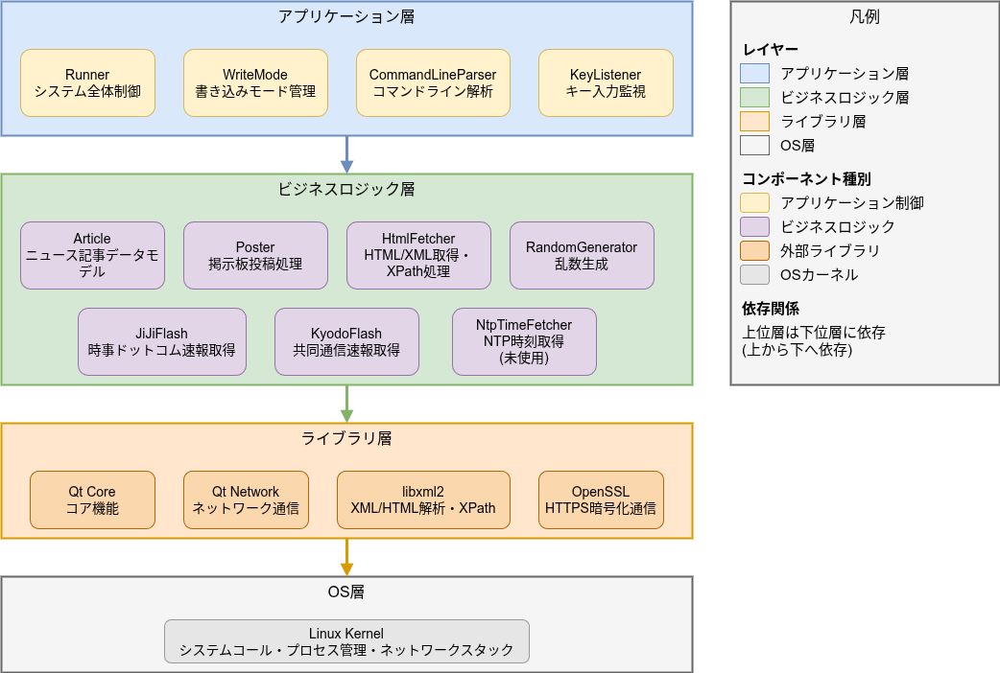

# qNewsFlash システム概要

## 1. プロジェクト概要

### 1.1 システム名称
qNewsFlash - 自動ニュース投稿システム  

### 1.2 システムの目的
qNewsFlashは、複数の外部ニュースソースから最新のニュース記事を自動的に収集し、0ch系掲示板に投稿することで、掲示板利用者に最新のニュース情報を提供するための自動化ツールです。  

### 1.3 基本機能概要
qNewsFlashは、外部ニュースサイトからXPathクエリおよびRSS/APIを用いてニュース記事を取得し、0ch系掲示板に自動投稿するツールです。  
取得した複数のニュース記事からランダムに1件のみを選択して投稿します。  

## 2. システムの特徴

### 2.1 多様なニュースソース対応
以下の主要なニュースソースに対応しています：  

- **News API**: 国際ニュースAPI
- **時事ドットコム**: RSS配信と速報HTML取得
- **共同通信**: RSSフィード配信
- **47NEWS（共同通信）**: 速報HTML取得
- **朝日新聞デジタル**: RSSフィード配信
- **毎日新聞**: RSS配信とHTML/XPath取得
- **CNET Japan**: RSS配信とHTML/XPath取得
- **ハンギョレ新聞**: RSSフィード配信
- **ロイター通信**: RSS配信とHTML/XPath取得
- **東京新聞**: HTML/XPath取得

### 2.2 柔軟な速報ニュース対応
通常のRSSフィード取得に加えて、速報ニュース専用の取得機能を実装：  

- **時事ドットコム速報**: XPathを用いた速報専用取得
- **47NEWS速報**: XPathを用いた共同通信速報取得
- 速報ニュースは通常ニュースとは異なる間隔（デフォルト10分）で取得可能

### 2.3 高度な乱数生成によるランダム選択
- CPUタイムスタンプカウンタ（TSC）とCSPRNG（暗号論的疑似乱数生成器）を組み合わせた高品質な乱数生成
- 取得した複数の記事から偏りのない公平な1件選択
- Xorshiftアルゴリズムとメルセンヌ・ツイスタの組み合わせによる高速かつ高品質な乱数

### 2.4 3種類の書き込みモード
ニュース投稿の要件に応じて、3つの書き込みモードから選択可能：  

#### モード1: 単一スレッド集約型
- 全てのニュース記事を1つのスレッドに集約して投稿
- スレッドが満杯になったら自動的に新規スレッドを作成
- ニュースアーカイブとして管理したい場合に最適

#### モード2: 常時新規スレッド作成型
- 各ニュース記事ごとに必ず新規スレッドを作成
- 各ニュースを独立したスレッドとして管理
- 個別の議論を促進したい場合に最適

#### モード3: ハイブリッド型
- 一般ニュースは新規スレッドを作成
- 速報ニュースは専用の1つのスレッドに集約
- 速報と一般ニュースを区別して管理したい場合に最適

### 2.5 完全な自動化対応
以下の3つの実行モードをサポート：

#### 自動実行モード（Systemd）
- Systemdサービスとして常駐
- 設定した間隔で自動的にニュース取得・投稿を実行
- タイマーによる遅延起動機能（デフォルト30秒）

#### ワンショットモード（Cron）
- Cronジョブからの実行に最適化
- 1回のみニュース取得・投稿を実行して終了
- リソース効率的な運用が可能

#### 対話実行モード
- コマンドラインから直接実行
- 「q」または「Q」キーで即座に終了可能
- テストや動作確認に最適

## 3. 技術的特徴

### 3.1 XPathによる柔軟なコンテンツ抽出
- libxml2ライブラリを使用した高度なXPath処理
- 設定ファイル（JSON）でXPath式を変更可能
- Webサイトの構造変更に柔軟に対応

### 3.2 Shift-JISエンコーディング完全対応
- 0ch系掲示板が要求するShift-JISに完全対応
- 変換不可能な文字は自動的に文字参照（&#xHHHH;）に変換
- 文字化けを防止する堅牢なエンコーディング処理

### 3.3 掲示板コマンドの自動投稿
以下の掲示板コマンドを自動的に投稿可能：

#### !chttコマンド
- スレッドタイトルを記事タイトルに自動変更
- 新規スレッド作成時に自動実行

#### !hogoコマンド
- 時限dat落ちルールを回避
- スレッドの保護に使用

#### !bottomコマンド
- 指定時間以上レスがないスレッドに自動投稿
- スレッドの沈降を防止（デフォルト180分間隔）

### 3.4 NTPによる正確な時刻管理
- NTPサーバから正確な時刻を取得
- 投稿時刻の精度を確保
- タイムアウト処理による安定動作

## 4. 設定管理の特徴

### 4.1 JSON形式の設定ファイル
- 全ての設定をJSON形式で管理
- 可読性が高く、編集が容易
- デフォルト値が定義されており、最小限の設定で動作可能

### 4.2 動的な設定変更
- 設定ファイルの変更を実行時に反映
- システムの再起動不要
- 運用中の柔軟な調整が可能

### 4.3 排他制御による安全性
- ロックファイルによる排他制御
- 複数プロセスからの同時アクセスを制御
- データ整合性を保証

## 5. ログ管理機能

### 5.1 構造化されたログ
- JSON形式のログファイル
- 機械的に処理可能な構造
- 詳細な投稿履歴の記録

### 5.2 自動ログローテーション
- 当日と前日のログのみを保持
- 2日以上前のログは自動削除
- ディスク容量の効率的な管理

### 5.3 投稿履歴の追跡
ログには以下の情報を記録：  

- 記事タイトル
- 記事本文
- 記事URL
- 公開日時
- 投稿日時
- スレッド情報（URL、スレッド番号、タイトル）

## 6. 信頼性と安定性

### 6.1 エラー耐性
- ネットワークエラー発生時も継続動作
- Webサイト構造変更時も他のソースから取得継続
- 設定ファイル破損の検出とエラー報告

### 6.2 非同期処理
- ニュース取得処理は非同期実行
- 複数ニュースソースからの並行取得
- 他の処理をブロックしない設計

### 6.3 適切なタイムアウト設定
- HTTPリクエストのタイムアウト
- ファイルアクセスのタイムアウト（5秒）
- 無応答状態の防止

## 7. セキュリティとライセンス

### 7.1 認証情報の安全管理
- News APIキー等は設定ファイルで管理
- ソースコードへの認証情報埋め込み禁止

### 7.2 HTTPS通信対応
- OpenSSL 3を使用した安全な通信
- Qt 6環境でのHTTPS完全対応

### 7.3 オープンソースライセンス遵守
- Qt（LGPL v3）
- libxml2（MIT License）
- 各ライブラリのライセンス文書を同梱

## 8. クロスプラットフォーム対応

### 8.1 サポートOS
- Red Hat Enterprise Linux
- SUSE Linux Enterprise
- openSUSE
- Debian
- Raspberry Pi OS

### 8.2 Qt バージョン対応
- Qt 5.15以降
- Qt 6.x系
- 同梱ライブラリによる依存性解決

### 8.3 CMakeビルドシステム
- CMake 3.16以上
- 異なる環境でも容易にビルド可能
- 自動依存関係解決

## 9. システムアーキテクチャ概要

### 9.1 レイヤー構造

  

<b>図: qNewsFlashレイヤーアーキテクチャ</b>

### 9.2 主要コンポーネント
- **Runner**: システム全体の制御
- **HtmlFetcher**: HTML/XML取得とXPath処理
- **JiJiFlash/KyodoFlash**: 速報ニュース専用取得
- **Poster**: 掲示板投稿処理
- **WriteMode**: 書き込みモード管理
- **Article**: ニュース記事データモデル
- **RandomGenerator**: 高品質乱数生成
- **NtpTimeFetcher**: NTP時刻取得 (未使用)
- **KeyListener**: キー入力監視
- **CommandLineParser**: コマンドライン解析

## 10. 想定されるユースケース

### 10.1 ニュース掲示板の運営
- 定期的な最新ニュースの自動投稿
- 速報ニュースの即時投稿
- ニュースアーカイブの構築

### 10.2 情報収集の自動化
- 複数ニュースソースの一元管理
- 特定カテゴリのニュース収集
- 投稿履歴の記録と分析

### 10.3 コミュニティ活性化
- 定期的な話題提供
- ニュースを起点とした議論の促進
- 新規スレッドの自動作成

---

**ドキュメント作成日**: 2026年3月7日  
**Rev**: 1.0a  
**対象システム**: qNewsFlash  
