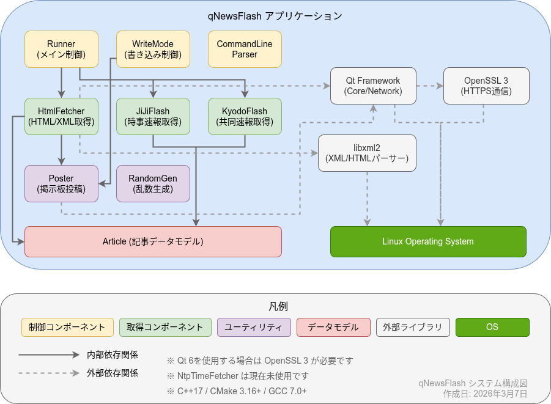

# qNewsFlash システム構成書

## 1. アーキテクチャ概要

### 1.1 システム構造図

```
<p align="center">
  
</p>
```

## 2. 主要コンポーネント

### 2.1 Runner (Runner.cpp/h)

**役割**:  
システム全体のメインコントローラ  

**責務**:  
- アプリケーションのライフサイクル管理
- 各ニュースソースからのRSS/API取得調整
- 取得したニュース記事のフィルタリング（日時、文字数）
- 記事選択ロジックの実行
- 定期実行タイマーの管理
- 速報ニュース取得の定期実行

**主要メソッド**:  
- `run()`: メイン処理の開始
- `fetchNonBreakingNews()`: 通常ニュース取得
- `fetchNewsAPI()`, `fetchJiJiRSS()`, `fetchKyodoRSS()` など: 各ニュースソースからの取得
- `JiJiFlashfetch()`, `KyodoFlashfetch()`: 速報ニュース取得
- `selectArticle()`: ランダムで記事を1件選択
- `isToday()`, `isHoursAgo()`: 日時フィルタリング

**依存関係**:  
- HtmlFetcher（HTTP通信、XPath抽出）
- JiJiFlash, KyodoFlash（速報取得）
- WriteMode（投稿処理）
- Article（データモデル）

### 2.2 HtmlFetcher (HtmlFetcher.cpp/h)

**役割**:  
HTML/XMLコンテンツの取得とXPath処理  

**責務**:  
- HTTP/HTTPS通信（QNetworkAccessManager使用）
- libxml2を用いたXPathクエリの実行
- スレッド情報（レス数、タイトル）の取得
- URL存在確認（HEAD リクエスト）
- Shift-JIS対応

**主要メソッド**:  
- `fetch()`: URLからHTML取得して本文抽出
- `fetchElement()`: XPathで指定した要素を取得
- `fetchParagraph()`: ニュース記事の本文抽出
- `fetchLastThreadNum()`: スレッドの最終レス番号取得
- `extractThreadPath()`, `extractThreadTitle()`: スレッド情報抽出
- `getNodeset()`: XPathクエリ実行（libxml2）
- `checkUrlExistence()`: URL存在確認

**依存関係**:  
- Qt Network（QNetworkAccessManager, QNetworkReply）
- libxml2（xmlDocPtr, xmlXPathObjectPtr）

### 2.3 JiJiFlash (JiJiFlash.cpp/h)

**役割**:  
時事ドットコムの速報ニュース取得専用  

**責務**:  
- 時事ドットコムの速報ページから最新の速報記事を取得
- XPathを用いた速報記事の抽出
- 日時フォーマット変換（ISO8601 → 日本語表記）
- 既存記事との重複チェック

**主要メソッド**:  
- `FetchFlash()`: 速報記事の取得処理
- `convertDate()`: 日時フォーマット変換
- `getArticleData()`: 記事データの取得

**設定情報（JIJIFLASHINFO構造体）**:  
- basisurl: 基準URL
- flashurl: 速報一覧URL
- flashxpath: 速報記事URL抽出XPath
- titlexpath: タイトル抽出XPath
- paraxpath: 本文抽出XPath
- pubdatexpath: 公開日時抽出XPath

### 2.4 KyodoFlash (KyodoFlash.cpp/h)

**役割**:  
47NEWS（共同通信）の速報ニュース取得専用  

**責務**:  
- 47NEWSの速報ページから最新の速報記事を取得
- XPathを用いた速報記事の抽出
- 日時フォーマット変換
- 既存記事との重複チェック

**主要メソッド**:  
- `FetchFlash()`: 速報記事の取得処理
- `convertDate()`: 日時フォーマット変換
- `getArticleData()`: 記事データの取得

**設定情報（KYODOFLASHINFO構造体）**:  
- basisurl: 基準URL
- flashurl: 速報一覧URL
- flashxpath: 速報記事URL抽出XPath
- titlexpath: タイトル抽出XPath
- paraxpath: 本文抽出XPath
- pubdatexpath: 公開日時抽出XPath

### 2.5 Poster (Poster.cpp/h)

**役割**:  
0ch系掲示板への投稿処理  

**責務**:  
- HTTP POSTによる掲示板への投稿
- Cookie管理（取得、保存）
- Shift-JISエンコーディング処理
- 文字参照変換（Shift-JIS非対応文字）
- URLエンコード処理
- レスポンス解析（成功/失敗判定）

**主要メソッド**:  
- `PostforWriteThread()`: 既存スレッドへの書き込み
- `PostforCreateThread()`: 新規スレッド作成
- `fetchCookies()`: Cookie取得
- `convertToShiftJIS()`: Shift-JISエンコード
- `convertNonSjisToReference()`: 文字参照変換
- `urlEncode()`: URLエンコード
- `replyPostFinished()`: レスポンス処理

**データ構造（THREAD_INFO）**:  
- subject: スレッドタイトル
- from: 名前欄
- mail: メール欄
- bbs: BBS名
- message: 投稿本文
- time: 投稿時刻
- key: スレッド番号

### 2.6 WriteMode (WriteMode.cpp/h)

**役割**:  
書き込みモードの管理とファイル操作（シングルトン）  

**責務**:  
- 3種類の書き込みモード実装（モード1、2、3）
- スレッドレス数の確認
- 設定ファイル（JSON）の読み書き（排他制御）
- ログファイル（JSON）の管理
- !bottomコマンドの投稿判定・処理
- スレッド情報の自動更新

**主要メソッド**:  
- `writeMode1()`, `writeMode2()`: 書き込みモード実行
- `checkLastThreadNum()`: レス数上限チェック
- `updateThreadJson()`: スレッド情報更新
- `writeLog()`: ログ記録
- `deleteLogNotToday()`: 古いログ削除
- `writeBottom()`: !bottomコマンド投稿
- `isHogoValue()`, `updateHogoJson()`: !hogo状態管理

**データ構造**:  
- WRITE_INFO: 書き込み設定情報
- WRITE_LOG: ログ情報

### 2.7 Article (Article.cpp/h)

**役割**:  
ニュース記事のデータモデル  

**責務**:  
- ニュース記事データの保持
- データの受け渡し

**保持データ**:  
- タイトル（QString）
- 本文（QString）
- URL（QString）
- 公開日時（QString）

**主要メソッド**:  
- コンストラクタ（複数のオーバーロード）
- `getArticleData()`: データ取得（tuple形式）

### 2.8 RandomGenerator (RandomGenerator.cpp/h)

**役割**:  
高品質な乱数生成  

**責務**:  
- CPUタイムスタンプカウンタ（TSC）からシード生成
- 暗号論的に安全な乱数生成器（CSPRNG）の利用
- Xorshiftアルゴリズムによるシード処理
- メルセンヌ・ツイスタによる一様分布生成

**主要メソッド**:  
- `Generate()`: 指定範囲の乱数生成
- `getTSC()`: TSC取得（x86_64アーキテクチャ）
- `csprng()`: CSPRNG値取得
- `hashTSC()`: TSCハッシュ処理
- `next()`: Xorshift実行

**アルゴリズム**:  
1. TSCとCSPRNGを組み合わせてシード生成
2. Xorshiftでシードを処理
3. メルセンヌ・ツイスタで一様分布の乱数生成

### 2.9 NtpTimeFetcher (NtpTimeFetcher.cpp/h)

**役割**:  
NTPサーバから正確な時刻取得  

**責務**:  
- NTPプロトコル通信（UDP/123）
- タイムアウト処理
- ネットワークエラー処理
- UNIX時刻からQDateTime変換

**主要メソッド**:  
- `fetchTime()`: NTP時刻取得
- `getDateTime()`: 取得した日時を返す
- `connectToHostWithTimeout()`: タイムアウト付き接続
- `readNtpReply()`: NTPレスポンス解析

**NTPサーバ**:  
- デフォルト: ntp.nict.jp（日本標準時プロジェクト）

### 2.10 KeyListener (KeyListener.cpp/h)

**役割**:  
ノンブロッキングなキー入力監視  

**責務**:  
- 別スレッドでのキー入力監視
- 'q'/'Q'キー検出
- 終了シグナル送信

**主要メソッド**:  
- `run()`: キー入力監視ループ（スレッド）
- `stop()`: 監視停止

**動作**:  
- QThreadを継承して別スレッドで実行
- 標準入力から文字を読み取り
- メインスレッドをブロックしない

### 2.11 CommandLineParser (CommandLineParser.cpp/h)

**役割**:  
コマンドライン引数の解析  

**責務**:  
- QCommandLineParserのラッパー
- オプション定義（--sysconf, --help, --version）
- 引数の検証

**主要メソッド**:  
- `process()`: 引数解析
- `isHelpSet()`, `isVersionSet()`, `isSysConfSet()`: オプション確認
- `unknownOptionNames()`: 不明なオプション取得

## 3. 外部インターフェース

### 3.1 外部ニュースソース（入力）

| ニュースソース | プロトコル | データ形式 | 取得方法 |
|--------------|----------|-----------|---------|
| News API | HTTPS | JSON | API |
| 時事ドットコム | HTTPS | RSS (RDF) | RSS |
| 時事ドットコム（速報） | HTTPS | HTML | XPath |
| 共同通信 | HTTPS | RSS | RSS |
| 47NEWS（速報） | HTTPS | HTML | XPath |
| 朝日新聞デジタル | HTTPS | RSS | RSS |
| 毎日新聞 | HTTPS | RSS + HTML | RSS + XPath |
| CNET Japan | HTTP/HTTPS | RSS + HTML | RSS + XPath |
| ハンギョレ新聞 | HTTPS | RSS | RSS |
| ロイター通信 | HTTPS | RSS + HTML | RSS + XPath |
| 東京新聞 | HTTPS | HTML | XPath |

### 3.2 0ch系掲示板（出力）

**プロトコル**: HTTP/HTTPS POST  

**エンコーディング**: Shift-JIS  

**必要な情報**:  
- subject: スレッドタイトル
- FROM: 名前
- mail: メールアドレス
- MESSAGE: 投稿本文
- bbs: BBS名
- key: スレッド番号（既存スレッドへの書き込み時）
- time: 投稿時刻（エポック秒）

**Cookie管理**:  
- POSTリクエスト前にGETリクエストでCookie取得
- QNetworkCookieJarで自動管理

### 3.3 NTPサーバ（入力） - 未使用

**プロトコル**: NTP (UDP/123)  

**サーバ**: ntp.nict.jp（日本標準時プロジェクト）  

**用途**: 正確な投稿時刻の取得  

**タイムアウト**: 5秒  

### 3.4 設定ファイル（入出力）

**フォーマット**: JSON  

**デフォルトパス**: `/etc/qNewsFlash/qNewsFlash.json`  

**排他制御**: ロックファイル（`.lock`）使用（QLockFile）  

**主要設定項目**:  
- ニュースソースの有効/無効
- RSS/API URL
- XPath式
- 取得間隔
- 掲示板設定（BBS名、スレッド番号、URL等）
- 書き込みモード
- ログファイルパス

### 3.5 ログファイル（出力）

**フォーマット**: JSON（配列形式）  

**デフォルトパス**: `/var/log/qNewsFlash_log.json`  

**排他制御**: ロックファイル（`.lock`）使用（QLockFile）  

**記録内容**:  
```json
[
  {
    "date": "2024年9月14日 17時55分",
    "paragraph": "記事の本文...",
    "thread": {
      "bottom": true,
      "key": "1726309722",
      "new": true,
      "time": "2024年9月14日 19時28分",
      "title": "スレッドタイトル",
      "url": "https://example.com/test/read.cgi/bbs/1726309722/"
    },
    "title": "記事タイトル",
    "url": "https://example.com/article/12345"
  }
]
```

**保持期間**: 当日および前日のログのみ（2日以上前は自動削除）  

## 4. システム要件

### 4.1 開発環境

| 項目 | 要件 |
|-----|-----|
| **プログラミング言語** | C++17以上 |
| **ビルドシステム** | CMake 3.16以上 |
| **コンパイラ** | GCC/G++ 7.0以上 |
| **推奨IDE** | Qt Creator、CLion、VSCodium |

### 4.2 ライブラリ依存

| ライブラリ | バージョン | 用途 | ライセンス |
|----------|----------|-----|----------|
| **Qt Core** | 5.15+ / 6.x | コアフレームワーク、イベントループ、JSON処理 | LGPL v3 |
| **Qt Network** | 5.15+ / 6.x | HTTP/HTTPS通信、Cookie管理 | LGPL v3 |
| **libxml2** | 2.0+ | XML/HTMLパーサー、XPath処理 | MIT |
| **OpenSSL** | 3.x | HTTPS通信（Qt 6使用時） | Apache 2.0 |

### 4.3 実行環境

| 項目 | 要件 |
|-----|-----|
| **OS** | Linux（RHEL、SLES、openSUSE、Debian、Ubuntu、Raspberry Pi OS等） |
| **カーネル** | 2.6.32以上 |
| **必須パッケージ** | coreutils、bash/zsh |
| **オプション** | systemd（サービス実行時）、cron（ワンショット実行時） |
| **ネットワーク** | インターネット接続（HTTPS、NTP対応） |
| **権限** | 通常ユーザー権限で実行可能（ログ・設定ファイルのパスによる） |

### 4.4 リソース要件

| 項目 | 推奨値 |
|-----|-------|
| **CPU** | 1コア以上 |
| **メモリ** | 128MB以上 |
| **ディスク** | 50MB以上（ログファイル容量を除く） |
| **ネットワーク帯域** | 1Mbps以上 |

## 5. ディレクトリ構成

```
qNewsFlash/
├── *.cpp, *.h                    # C++ソースコード（18ファイル）
│   ├── main.cpp                 # エントリーポイント
│   ├── Runner.cpp/h             # メインコントローラ
│   ├── HtmlFetcher.cpp/h        # HTTP通信・XPath処理
│   ├── Poster.cpp/h             # 掲示板投稿
│   ├── WriteMode.cpp/h          # 書き込みモード管理
│   ├── Article.cpp/h            # データモデル
│   ├── JiJiFlash.cpp/h          # 時事速報取得
│   ├── KyodoFlash.cpp/h         # 共同速報取得
│   ├── RandomGenerator.cpp/h    # 乱数生成
│   ├── NtpTimeFetcher.cpp/h     # NTP時刻取得
│   ├── KeyListener.cpp/h        # キー入力監視
│   └── CommandLineParser.cpp/h  # コマンドライン解析
│
├── CMakeLists.txt        # CMakeビルド設定
├── README.md             # プロジェクト説明書
├── LICENSE.md            # ライセンス
├── 要件定義書.md           # 要件定義書
├── システム構成.md         # 本文書
├── データフロー.md         # データフロー設計書
│
├── etc/                        # 設定ファイルテンプレート
│   ├── qNewsFlash.json.in     # 設定ファイルテンプレート
│   ├── qnewsflash.service.in  # Systemdサービスファイル
│   └── qnewsflash.timer.in    # Systemdタイマーファイル
│
├── Scripts/                 # ラッパースクリプト
│   └── qNewsFlash.sh.in    # Qt 5ライブラリ同梱版用スクリプト
│
├── Qt5/                    # Qt 5ライブラリ（同梱）
│   ├── libQt5Core.so.5.15.2
│   ├── libQt5Network.so.5.15.2
│   └── libicu*.so.*
│
├── Qt6/                    # Qt 6ライブラリ（同梱）
│   ├── libQt6Core.so.6.5.3
│   ├── libQt6Network.so.6.5.3
│   └── libicu*.so.*
│
├── LibraryLicenses/        # ライブラリライセンス文書
│   ├── Qt/
│   │   └── LICENSE.LGPLv3
│   └── libxml2/
│       └── LICENSE.MIT
│
├── qNewsFlash_Libre_Settings/  # 設定ファイル例
│   ├── qNewsFlash.json        # 通常ニュース設定例
│   ├── qNewsFlashJF.json      # 時事速報設定例
│   ├── Bottom.json            # !bottomコマンド専用設定例
│   └── README.txt
│
├── HC/                         # ヘルプ用画像
│   └── Qt_SDK_Install_*.png
│
├── 今後の予定.txt
├── 次回のコミット.txt
└── .gitignore
```

### 5.1 インストール後のディレクトリ構成

```
# デフォルトインストール（CMAKE_INSTALL_PREFIX=/usr/local）

/usr/local/
├── bin/
│   ├── qNewsFlash          # 実行ファイル
│   └── qNewsFlash.sh       # ラッパースクリプト
│
└── lib/ (または lib64/)
    └── Qt/                 # Qt 5ライブラリ（同梱版使用時）
        ├── libQt5Core.so.5.15.2
        ├── libQt5Network.so.5.15.2
        └── libicu*.so.*

/etc/
└── qNewsFlash/
    └── qNewsFlash.json     # 設定ファイル

/var/log/
└── qNewsFlash_log.json     # ログファイル

# Systemdサービス（system）
/etc/systemd/system/
├── qnewsflash.service
└── qnewsflash.timer

# Systemdサービス（user）
~/.config/systemd/user/
├── qnewsflash.service
└── qnewsflash.timer
```

## 6. ビルド設定

### 6.1 CMakeオプション

| オプション | デフォルト値 | 説明 |
|-----------|------------|------|
| CMAKE_BUILD_TYPE | Release | ビルドタイプ（Release/Debug） |
| CMAKE_INSTALL_PREFIX | /usr/local | インストールディレクトリ |
| SYSCONF_DIR | /etc/qNewsFlash/qNewsFlash.json | 設定ファイルパス |
| SYSTEMD | OFF | Systemdサービスインストール（system/user/OFF） |
| PID | /var/run | PIDファイルディレクトリ（Systemd使用時） |
| WITH_LIBXML2 | (空) | libxml2 pkgconfigパス（カスタムインストール時） |
| WITH_OPENSSL3 | (空) | OpenSSL 3インストールパス（カスタムインストール時） |

### 6.2 ビルド例

```bash
# 標準的なビルド
cmake -DCMAKE_BUILD_TYPE=Release \
      -DCMAKE_INSTALL_PREFIX=/usr/local \
      -DSYSCONF_DIR=/etc/qNewsFlash/qNewsFlash.json \
      ..

# Systemdユーザーサービスとしてインストール
cmake -DCMAKE_BUILD_TYPE=Release \
      -DCMAKE_INSTALL_PREFIX=$HOME/.local \
      -DSYSCONF_DIR=$HOME/.config/qNewsFlash/qNewsFlash.json \
      -DSYSTEMD=user \
      -DPID=/tmp \
      ..

make -j $(nproc)
make install
```

## 7. 技術的特徴

### 7.1 非同期処理
- Qt のシグナル・スロット機構を活用
- QNetworkAccessManager による非同期HTTP通信
- イベントループによるノンブロッキングI/O

### 7.2 排他制御
- QLockFile による設定ファイル・ログファイルの排他制御
- タイムアウト設定（5秒）
- 複数プロセスからの同時アクセスを防止

### 7.3 エラーハンドリング
- ネットワークエラー時の継続動作
- XPath抽出失敗時のグレースフルな処理
- 設定ファイル破損検出

### 7.4 拡張性
- 設定ファイルベースの柔軟な構成
- XPath式の外部化（Webサイト構造変更への対応）
- 新規ニュースソース追加の容易性

---

**作成日**: 2026年3月7日  
**Rev**: 1.0a  
**対象システム**: qNewsFlash  
