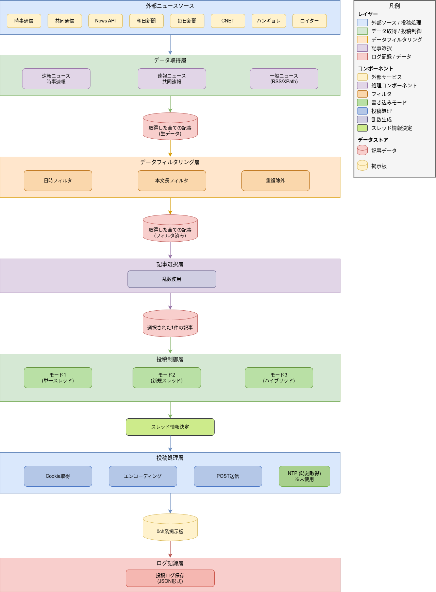

# qNewsFlash データフロー

## 1. データフロー概要

qNewsFlashシステムは、外部ニュースソースからのデータ取得、内部処理、掲示板への投稿という一連のデータフローを持ちます。  
本ドキュメントでは、各段階におけるデータの変換と流れを記述します。  

## 2. 全体データフロー図

**
図: qNewsFlash全体データフロー
**  

データフローは以下の8つの主要レイヤーで構成されています：  

1. **外部ニュースソース層**: News API、時事COM、共同通信、朝日新聞、毎日新聞、CNET、ハンギョレ、ロイター等  
2. **データ取得層**: RSS/XPath取得、速報ニュース取得  
3. **データフィルタリング層**: 日時フィルタ、本文長フィルタ、重複除外  
4. **記事選択層**: ランダム選択による1件抽出  
5. **投稿制御層**: 3つの書き込みモード判定とスレッド情報決定  
6. **投稿処理層**: Cookie取得、エンコーディング、NTP時刻取得(未使用)、POST送信  
7. **0ch系掲示板**: 投稿先  
8. **ログ記録層**: JSON形式での投稿履歴保存  

## 3. 詳細データフロー

### 3.1 ニュース記事取得フロー

#### 3.1.1 RSS/APIベースの取得フロー

ニュース記事取得処理は、複数の外部ニュースソースから並行して記事データを取得します。  

**News APIからの取得**では、まずHTTP GETリクエストを送信してJSON形式のレスポンスを受信します。  
受信したJSONデータを解析し、記事配列を抽出します。  
各記事から、タイトル、本文、URL、公開日時を抽出し、ソース名として「NewsAPI」を設定した記事オブジェクトを生成します。  

**時事ドットコムRSS**からの取得も同様に、HTTP GETリクエストを送信してXML形式のレスポンスを受信します。  
XMLデータを解析し、アイテム要素を取得します。  
各アイテムからタイトル、本文、URL、公開日時を抽出し、ソース名として「時事COM_RSS」を設定した記事オブジェクトを生成します。  

**共同通信RSS**やその他のRSSソースも、時事ドットコムRSSと同様の処理を行います。  

最後に、全てのソースから取得した記事を単一の記事リストに統合します。  

#### 3.1.2 速報ニュース取得フロー

速報ニュース取得は、通常のRSS取得とは独立して実行されます。  

**時事速報**の取得では、時事ドットコムの速報ページにHTTP GETリクエストを送信し、HTML形式のレスポンスを受信します。  
HTMLをパースし、設定ファイルで指定されたXPath式を使用して、タイトル、本文、URL、日時の各要素を抽出します。  
抽出した日時は「MM月DD日 HH:MM」形式からISO 8601形式に変換します。  
記事オブジェクトを生成する際、ソース名を「時事速報」とし、速報フラグをtrueに設定します。  

**共同速報 (47NEWS)**の取得も、時事速報と同様の処理を行い、ソース名を「共同速報」として記事オブジェクトを生成します。  

#### 3.1.3 XPathベースの取得フロー (東京新聞等)

XPathベースの取得では、まず対象のニュースサイト (例：東京新聞)にHTTP GETリクエストを送信し、HTML形式のレスポンスを受信します。  

受信したHTMLからDOMツリーを構築し、設定ファイルで指定されたXPath式を使用して、タイトル、本文、URL、公開日時の各要素を抽出します。  

抽出したテキストノードに対して、前後の空白除去、HTMLタグ除去、改行の正規化等の処理を行います。  
URLは相対URLから絶対URLに変換します。

最後に、整形済みのデータを使用して記事オブジェクトを生成し、ソース名を「東京新聞」として設定します。  

### 3.2 データフィルタリングフロー

取得した生の記事リストに対して、複数のフィルタリング処理を順次適用します。  

**日時フィルタリング**では、まず現在日時を取得し、各記事の公開日時と比較します。  
当日の記事のみを対象とする場合は、公開日と現在日を比較します。  
時間範囲でフィルタリングする場合は、現在時刻と公開時刻の差分が指定時間以内かを確認します。  
条件に合致する記事のみを保持します。  

**本文長フィルタリング**では、各記事の本文の文字数をカウントし、設定されている最大文字数と比較します。  
超過分があれば、指定文字数で切り捨てを行います。  

**重複除外**では、まずログファイルを読み込んで投稿済みのURL一覧を取得します。  
各記事のURLを投稿済みURL一覧と照合し、効率的な検索のためにハッシュセット構造を使用します。  
未投稿の記事のみを保持します。  

**ソース固有フィルタ**として、News APIでは除外リストと照合して特定メディアを除外し、共同通信ではタイトルパターンマッチングによってニュースカテゴリを絞り込みます。  

フィルタリング済みの記事リストが出力されます。  

### 3.3 記事選択フロー

フィルタリング済みの記事リスト (N件)から、ランダムに1件を選択します。  

まず記事数をチェックし、0件の場合はエラーとして処理を終了します。  
1件以上ある場合は選択処理を継続します。

乱数生成器のシングルトンインスタンスを取得し、初期化済みかを確認します。  
未初期化の場合は、CPUのタイムスタンプカウンタを取得し、暗号論的疑似乱数生成器でシード値を生成します。  
次にXorshiftアルゴリズムとメルセンヌ・ツイスターを初期化します。  

乱数生成では、Xorshiftによる高速乱数生成を行い、メルセンヌ・ツイスタで一様分布に調整します。  
モジュロバイアスを回避する処理を行い、0からN-1の範囲内のインデックスを返却します。  

返却されたインデックスを使用して、記事リストから1件の記事を選択します。  
選択された記事が出力されます。  

### 3.4 投稿準備フロー

選択された記事に対して、投稿先を決定する処理を行います。  

**書き込みモード判定**として、設定ファイルで指定された書き込みモードに応じて処理が分岐します。  

モード1 (単一スレッド)では、既存スレッドの情報を取得し、現在のレス数をチェックします。  
最大レス数未満であれば既存スレッドに投稿し、最大レス数以上であれば新規スレッドを作成します。  

モード2 (常時新規)では、常に新規スレッドを作成します。  

モード3 (ハイブリッド)では、記事が速報かどうかを判定します。  
速報の場合は速報専用スレッドを取得してレス数をチェックし、投稿先を決定します。速報でない場合は新規スレッドを作成します。  

**スレッド存在確認**では、指定されたスレッドURLに対してHTTP HEADリクエストを送信し、ステータスコードを確認します。  
200 OKであればスレッドが存在し、404 Not Foundであればスレッドが不在です。  
不在の場合は新規作成に移行します。  

**投稿パラメータ構築**として、投稿先スレッドURL、スレッド番号、新規作成フラグ、掲示板コマンド (!chtt、!hogo、!bottom)等のパラメータを構築します。  

構築された投稿パラメータが出力されます。  

### 3.5 投稿実行フロー

記事と投稿パラメータを使用して、実際の投稿処理を実行します。  

**Cookie取得**では、まず掲示板のトップページにHTTP GETリクエストを送信し、Set-Cookieヘッダを受信します。  
受信したCookieを保存し、以降のリクエストで自動的に送信されるようにします。  

**NTP時刻取得 (未使用)**では、UDPソケットを作成し、NTPサーバ (ntp.nict.jp:123)にリクエストを送信します。  
タイムアウトは5秒に設定し、タイムアウトした場合はシステム時刻を使用します。  
NTPレスポンスを受信したら、パケットを解析してTransmit Timestampを抽出し、日時オブジェクトに変換します。  

**エンコーディング処理**では、記事のタイトルと本文をUTF-8からShift-JISに変換します。  
変換可能な文字は直接Shift-JISに変換し、変換不可能な文字は文字のUnicodeコードポイントを取得して16進数文字列に変換し、HTML数値文字参照形式で埋め込みます。  

**POSTデータ構築**では、タイトル、本文、時刻、送信ボタン等のデータをURLエンコーディングし、application/x-www-form-urlencoded形式で構築します。  

**HTTP POST送信**では、新規スレッドの場合と既存スレッドの場合でPOSTエンドポイントを決定します。  
リクエストにContent-Type、Cookie、User-Agent等のヘッダを設定し、非同期でPOSTリクエストを送信してレスポンスを待機します。  

**レスポンス処理**では、HTTPステータスコードを確認し、200または302であれば成功と判定します。  
その他のステータスコードの場合はエラーとします。  
新規スレッド作成時は、レスポンスボディからスレッドURLとスレッド番号を抽出し、設定ファイルに保存します。  
エラーメッセージを検出するため、「ERROR」文字列の有無を確認します。  

最後に、成功フラグ、スレッドURL、スレッド番号、エラーメッセージ、HTTPステータスコードを含む結果を返却します。  

### 3.6 ログ記録フロー

投稿が完了した後、記事と投稿結果をログファイルに記録します。  

**ログファイル読み込み**では、まずロックファイルを取得します。(タイムアウト5秒)  
ロックを取得したら、JSONファイルを読み込んでデータを解析します。  

**ログエントリ作成**では、記事のタイトル、本文、URL、公開日時、投稿日時 (現在日時)、スレッドURL、スレッド番号、スレッドタイトル、ソース名、書き込みモードを含むエントリを作成します。  

**ログローテーション**では、現在日付を取得し、各エントリの投稿日時を解析して日付差分を計算します。  
2日以上前のエントリを削除します。  

**ログ保存**では、JSON配列に新しいエントリを追加し、整形フォーマットでJSONドキュメントを作成します。  
まず一時ファイルに書き込み、書き込みが成功したらアトミック置換 (リネーム)で本ファイルに上書きします。  
最後にロックファイルを解放します。  

**設定ファイル更新**では、設定ファイルのロックを取得し、JSONを読み込んで更新します。  
スレッドURL、スレッド番号、最終投稿時刻を更新し、一時ファイルに書き込んだ後、アトミック置換で設定ファイルを更新します。  
最後にロックを解放します。  

ログ記録が完了します。  

## 4. エラーハンドリングフロー

### 4.1 ネットワークエラーハンドリング

ネットワークエラーが発生した場合、エラーシグナルを受信してエラーコードを取得します。  
エラーを分類し (接続拒否、ホスト切断、ホスト未検出、タイムアウト等)、エラーコード、エラーメッセージ、URL、タイムスタンプをログに出力します。  

リトライ判定では、タイムアウトエラーの場合はリトライ可能と判定し、その他のエラーはスキップします。  
リトライカウントを確認し、最大リトライ回数 (3回)未満であれば再試行し、上限に達した場合はスキップします。  

次のニュースソースへ移行し、処理を継続します。  

### 4.2 XPath抽出エラーハンドリング

XPath抽出が失敗した場合、libxml2ライブラリがエラーを検出します。  
XPath式、ソースURL、エラー詳細、HTML構造のサンプルをログに出力します。  

デフォルト値として、タイトルを「タイトル取得失敗」、本文を空文字列、URLを元のURL、公開日時を現在日時に設定します。  

処理を継続し、他のソースから取得を続けます。  

### 4.3 ファイルアクセスエラーハンドリング

ファイルロック取得が失敗した場合、タイムアウトを検出してエラーログを出力します。  
ログにはファイルパス、ロック所有者のプロセスID、タイムアウト時間を含めます。  

リトライとして、500ミリ秒待機してから再試行を行います。(最大3回)  

失敗した場合はエラーを返却し、処理をスキップします。  

## 5. 設定ファイルデータフロー

### 5.1 設定読み込みフロー

アプリケーション起動時、まずコマンドラインを解析して`--sysconf`オプションを確認します。  
指定がある場合は指定パスを使用し、指定がない場合はデフォルトパスを使用します。  

ロックファイルを取得し、JSONファイルを読み込んでデータを解析します。  
設定値の抽出と検証を行い、必須フィールドの存在確認、データ型の検証、値の範囲チェックを実施します。  
検証した設定値をメンバ変数に格納し、最後にロックを解放します。  

### 5.2 設定更新フロー

設定の動的変更では、定期的にタイマイベントが発生し、設定再読み込み処理を実行します。  

ファイルの更新時刻を確認し、前回読み込み時刻と比較します。変更があれば再読み込みを行います。  

ロックファイルを取得し、JSONファイルを読み込んで設定値を検証します。  
メンバ変数として、取得間隔、最大本文長、書き込みモード、その他の設定を更新し、最後にロックを解放します。  

### 5.3 設定書き込みフロー

スレッド情報更新時、まずロックファイルを取得します。(タイムアウト5秒)  

現在の設定をJSONファイルから読み込んで解析します。  
スレッド情報のオブジェクトを修正し、スレッドURL、スレッド番号、スレッドタイトル、最終投稿時刻を更新します。  

一時ファイルへ整形されたJSON形式で書き込みを行います。  
書き込みが成功したら、一時ファイルを本ファイルにリネームしてアトミックに置換します。  
失敗した場合はロールバックします。  

最後にロックファイルを解放します。  

## 6. データ変換詳細

### 6.1 日時フォーマット変換

入力される日時は複数の形式があります。  

**ISO 8601形式** (例：「2024-12-04T03:15:00+09:00」)は、標準の日時解析機能で直接パースできます。  

**RFC 2822形式** (例：「Wed, 04 Dec 2024 03:15:00 +0900」)は、RSS で使用される形式で、専用の解析機能でパースします。  

**時事速報形式** (例：「12月04日 03:15」)は、正規表現でパースし、年は現在年を使用して日時オブジェクトを構築します。  

**共同速報形式** (例：「2024/12/04 03:15」)は、パターン指定でパースします。  

全ての形式をISO 8601形式 (例：「2024-12-04T03:15:00+09:00」)に統一します。  

### 6.2 文字エンコーディング変換

UTF-8入力をShift-JISに変換する処理では、まず変換可能な文字かどうかを判定します。  

変換可能な文字は、文字エンコーディング機能で直接Shift-JISに変換します。  

変換不可能な文字 (Shift-JISで表現できない文字)については、文字のUnicodeコードポイントを取得し、16進数文字列に変換します。  
そしてHTML数値文字参照形式 (例：「𠀋」を「&#x2000B;」に変換)で埋め込みます。  

最終的にShift-JISのバイト配列として出力します。  

### 6.3 URL正規化

相対URLを絶対URLに変換する処理では、まず基準URLとして元のページのURLを決定します。  

URL解決機能を使用して相対URLを絶対URLに変換します。  
例えば、「/path/to/news」は「https://example.com/path/to/news」に、「../news」は「https://example.com/news」に、  
「news.html」は「https://example.com/path/news.html」に変換されます。  

URLエンコーディングとして、日本語パスをパーセントエンコーディングし、クエリパラメータもエンコードします。  

完全な絶対URLとして出力します。  

### 6.4 HTMLタグ除去

HTML入力からプレーンテキストを抽出する処理では、まず正規表現でHTMLタグを除去します。  
 (例：「
テキスト
」を「テキスト」に変換)  

HTMLエンティティをデコードします。  
「&lt;」を「<」に、「&gt;」を「>」に、「&amp;」を「&」に、「&#数値;」を対応する文字に変換します。  

空白を正規化し、連続する空白を単一スペースに、行頭・行末の空白を削除し、空行を削除します。  

プレーンテキストとして出力します。  

## 7. コンポーネント間データ受け渡し

### 7.1 Articleオブジェクトの構造

記事オブジェクトは、ニュース記事の情報を保持するデータ構造です。  
保持する情報として、記事タイトル、記事本文、記事URL、公開日時、ニュースソース名、速報フラグがあります。  

複数のコンストラクタが用意されており、デフォルトコンストラクタと、タイトル、本文、URL、公開日時を指定するコンストラクタがあります。  

### 7.2 PostParametersの構造

投稿パラメータは、掲示板への投稿に必要な情報を保持する構造体です。  
保持する情報として、スレッドURL、スレッド番号、板名、新規スレッドフラグ、掲示板コマンドリスト、書き込みモードがあります。  

これらの情報は投稿制御層で決定され、投稿処理層に渡されます。  

### 7.3 PostResultの構造

投稿結果は、掲示板への投稿結果を保持する構造体です。  
保持する情報として、成功フラグ、作成されたスレッドURL、スレッド番号、エラーメッセージ、HTTPステータスコードがあります。  

投稿処理層から返却され、ログ記録層で使用されます。  

## 8. タイミング制御フロー

### 8.1 定期実行タイマフロー

システム起動時、メイン関数からRunnerの開始処理を呼び出します。  

**通常ニュース取得タイマ**は、設定された取得間隔 (ミリ秒単位)で開始し、タイムアウトイベントでニュース取得処理を実行します。  
デフォルトは30分ごとです。  

**速報ニュース取得タイマ**も同様に、設定された速報取得間隔で開始し、タイムアウトイベントで速報ニュース取得処理を実行します。  
デフォルトは10分ごとです。  

**!bottomコマンドタイマ**は、設定された間隔で開始し、タイムアウトイベントでbottomコマンドチェック処理を実行します。  
デフォルトは180分ごとです。

**設定再読み込みタイマ**は、1分ごとに開始し、タイムアウトイベントで設定再読み込み処理を実行します。  

### 8.2 Systemd起動フロー

システムブート時、systemdがqnewsflashタイマを起動します。  
タイマは30秒待機してから、qnewsflashサービスを起動します。  

サービスのタイプはsimpleで、実行ファイルとして/usr/local/bin/qNewsFlashを指定します。障害発生時は自動的に再起動します。  

プロセスが起動すると、メイン関数からRunnerの開始処理が呼び出されます。  

### 8.3 Cron実行フロー

Cronの定期実行では、crontab設定 (例：30分ごとに実行)に従って、qNewsFlashコマンドをワンショットオプション付きで実行します。  

メイン関数でワンショットオプションを検出し、Runnerのワンショット実行処理を呼び出します。  
この処理では、ニュース取得、フィルタリング、記事選択、投稿、ログ保存を1回のみ実行して終了します。  

## 9. 並行処理とシグナルフロー

### 9.1 非同期HTTP通信フロー

HTTPリクエストを開始すると、非同期でリクエストが送信され、メインスレッドは即座に解放されてブロックされません。  
イベントループは継続し、他の処理を実行できます。  

レスポンスが到着すると、finished()シグナルが発行されます。  
このシグナルに接続されたスロット関数が呼び出され、レスポンスデータを読み取って処理を行い、次の処理へ進みます。  

### 9.2 KeyListenerスレッドフロー

メインスレッドからKeyListenerの開始処理を呼び出すと、別スレッドが起動されます。  

別スレッドでは、無限ループでキー入力を待機します。(ブロッキング)  
'q'または'Q'が入力されると、終了シグナルを発行してメインスレッドに通知します。その他のキーの場合は無視して処理を継続します。  

メインスレッドが終了シグナルを受信すると、アプリケーション終了処理を実行します。  

## 10. データ永続化フロー

### 10.1 ログファイル構造

ログファイルはJSON配列形式で、各エントリには以下の情報が含まれます：  
ニュースタイトル、ニュース本文 (最大100文字)、記事URL、公開日時 (ISO 8601形式)、投稿日時 (ISO 8601形式)、スレッドURL、スレッド番号、スレッドタイトル、ソース名、書き込みモード  

各エントリはオブジェクト形式で格納され、配列として複数のエントリが保持されます。  

### 10.2 設定ファイル構造

設定ファイルもJSON形式で、以下の主要な設定が含まれます：  
通常ニュース取得間隔 (分)、速報ニュース取得間隔 (分)、本文最大文字数、書き込みモード、スレッド最大レス数、スレッドURL、スレッド番号、最終投稿時刻 (ISO 8601形式)、ログファイルパス  

また、各ニュースソースごとの設定として、有効/無効フラグ、APIキー、取得URL、最大件数等が含まれます。  

## 11. シーケンス図

システムの動作を理解するために、以下の6つの主要なシーケンスを説明します。  
詳細な図は「データフロー.png」を参照してください。  

### 11.1 記事取得から投稿までの完全シーケンス

タイマがタイムアウトシグナルを発行し、Runnerがニュース記事取得を開始します。  
HtmlFetcherがニュースサイトにHTTP GETリクエストを送信し、レスポンスを受信します。XPathまたはJSON解析を行い、記事リストをRunnerに返します。  

Runnerはデータフィルタリング (日時、本文長、重複除外)を実行し、ランダム記事選択のためにRandomGeneratorを呼び出します。  
RandomGeneratorはTSCとCSPRNGを使用してランダムインデックスを生成し、Runnerに返します。  
選択された記事がRunnerからWriteModeに渡されます。  

WriteModeは書き込みモードを判定し、スレッド存在確認とレス数チェックを行います。その後、Posterに投稿処理を依頼します。  

Posterは掲示板からCookieを取得します。  
記事のエンコーディング処理 (UTF-8からShift-JISへの変換と文字参照変換)を実行し、掲示板にHTTP POST送信を行います。  
掲示板からSuccessレスポンスを受信すると、PostResultをWriteModeに返します。  

WriteModeはログファイルに記事情報を保存します。  
JSON書き込みとロックファイル制御を行い、保存完了後に設定ファイルを更新します。全ての処理が完了すると、Runnerに完了を通知します。  

Runnerは次回実行のためにタイマを待機状態に戻します。  

### 11.2 速報ニュース取得シーケンス

速報ニュース専用のタイマ (10分間隔)がタイムアウトシグナルを発行し、Runnerが速報取得処理を開始します。  

時事速報と共同速報の取得が並行して実行されます。  
JiJiFlashが時事COM速報サイトにHTTP GETリクエストを送信してHTMLレスポンスを受信し、XPath抽出と日時変換を行います。  
速報フラグをtrueに設定した記事をRunnerに返します。  

同時に、KyodoFlashが47NEWS速報サイトにHTTP GETリクエストを送信してHTMLレスポンスを受信し、同様にXPath抽出と日時変換を行います。  
速報フラグをtrueに設定した記事をRunnerに返します。  

Runnerは両方の速報記事を通常の記事リストに追加し、通常のフローで処理します。  

### 11.3 設定ファイル更新シーケンス

WriteModeが設定ファイルの更新を開始し、まずロックファイルのロック取得を試みます。(タイムアウト5秒)  

ロック取得に成功した場合、設定ファイルから現在の設定を読み込んでJSONデータを取得します。  
スレッド情報 (スレッドURL、スレッド番号等)を更新し、一時ファイルへ書き込みます。  
書き込み完了後、一時ファイルを設定ファイルにリネームしてアトミックに置換します。最後にロックファイルを解放します。  

ロック取得に失敗した場合は、タイムアウトエラーを返し、WriteModeはエラーログを出力してリトライまたはスキップを行います。    

### 11.4 非同期HTTP通信シーケンス

Runnerがネットワークアクセスマネージャーにリクエストを送信すると、マネージャーがサーバにHTTP GETリクエストを送信します。  

非同期処理のため、メインスレッドは即座に解放され、Runnerは他の処理を継続できます。  

サーバからHTTPレスポンスが到着すると、ネットワークリプライオブジェクトがQtイベントループにfinished()シグナルを送信します。  
イベントループはRunnerのレスポンス処理スロット関数を呼び出します。  

Runnerはリプライオブジェクトからレスポンスデータを読み取り、データ処理を行って次のステップに進みます。  

### 11.5 KeyListenerスレッドシーケンス

メインスレッドがKeyListenerの開始処理を呼び出すと、KeyListenerが別スレッドとしてKeyListenerスレッドを起動します。  

別スレッドで実行されるKeyListenerスレッドは、ループでキー入力を待機します。(ブロッキング)  

ユーザーが'q'または'Q'を入力すると、スレッドが終了シグナルを発行してメインスレッドに通知します。  
メインスレッドはこのシグナルを受信し、アプリケーション終了処理を実行します。  

その他のキーが入力された場合は、無視して待機ループを継続します。  

### 11.6 エラーハンドリングシーケンス

RunnerがHtmlFetcherにニュース取得を依頼すると、HtmlFetcherがネットワークアクセスマネージャーにリクエストを送信します。  

ネットワークエラーが発生した場合、リプライオブジェクトがerror()シグナルを発行してHtmlFetcherにエラーを通知します。  
HtmlFetcherはエラーを分類 (Timeout、Connection等)し、リトライ可能かどうかを判定します。  

リトライ可能な場合、リトライカウントを確認します。  
リトライ回数が3回未満であれば再試行を行います。  
リトライ上限に達した場合は、エラーログに出力して次のニュースソースへ移行します。  

リトライ不可能な場合は、エラーログに出力してスキップし、処理を継続します。  

XPath抽出エラーの場合、正常レスポンスを受信してもXPath抽出が失敗します。  
HtmlFetcherはXPathエラーログ (XPath式、URL、HTML構造を含む)を出力し、デフォルト値を設定して次のソースへ移行します。  

最終的に、HtmlFetcherは取得成功分の記事リストのみをRunnerに返します。  
システムは継続して動作します。  

---

**ドキュメント作成日**: 2026年3月7日  
**Rev**: 1.0a  
**対象システム**: qNewsFlash  
